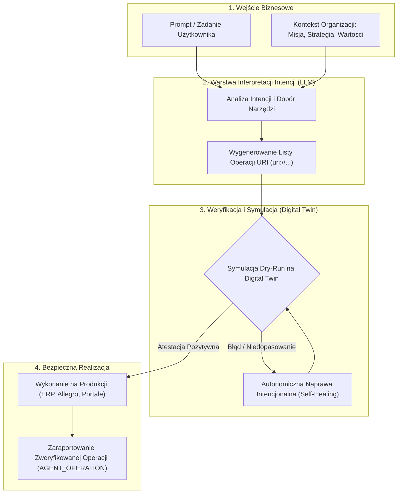
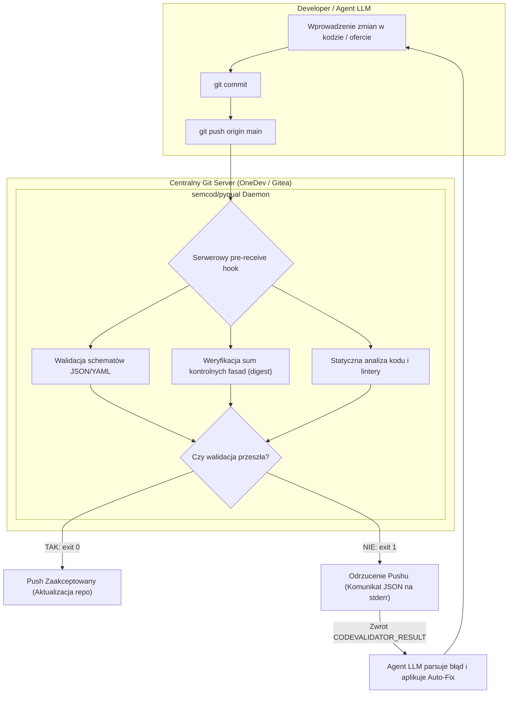
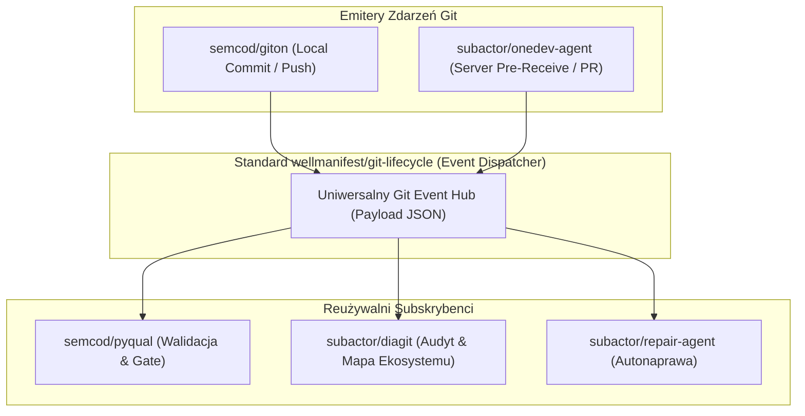
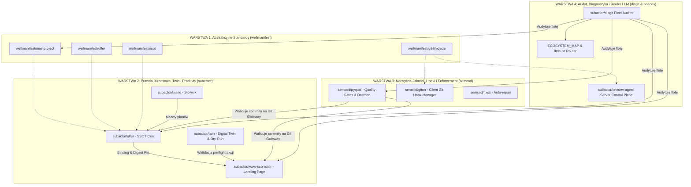

# Raport Strategiczno-Techniczny: Pozycjonowanie Subactor, Architektura Oferty, Walidacja Jakości i Mapa Ekosystemu

**Data:** 2026-08-19  
**Status:** Wersja Finalna (Kompletna)  
**Organizacja / Inicjatywa:** Subactor / Softreck  
**Obszar:** Architektura Ekosystemu (`subactor`, `wellmanifest`, `semcod`)  
**Repozytorium docelowe:** [`subactor/marketing`](https://github.com/subactor/marketing)  

---

## Spis Treści
1. [Streszczenie Wykonawcze i Teza Pozycjonowania (LLM vs Subactor)](#1-streszczenie-wykonawcze-i-teza-pozycjonowania-llm-vs-subactor)
   - 1.1. Ograniczenia Modeli Językowych (Probabilistyka Słów)
   - 1.2. Subactor jako Deterministyczny Silnik Wykonawczy (Intent-to-URI & Digital Twin)
2. [Stan Faktyczny Oferty Komercyjnej (Ground Truth z Kodu)](#2-stan-faktyczny-oferty-komercyjnej-ground-truth-z-kodu)
   - 2.1. Architektura SSOT: `subactor/offer` vs `wellmanifest/offer`
   - 2.2. Cennik i Pakiety v2: Jednostka `AGENT_OPERATION`
   - 2.3. Mechanizm Rzutowania (Pinning & Runtime Facade)
   - 2.4. Zmiany w Repozytoriach w Ostatnich 48h
3. [Walidacja Kodu, Przechwytywanie Zdarzeń Git i Reużywalność Modułów](#3-walidacja-kodu-przechwytywanie-zdarzeń-git-i-reużywalność-modułów)
   - 3.1. Rola `semcod/pyqual` w Zapewnieniu Jakości
   - 3.2. Bramki Pre-Commit oraz CI Pipeline
   - 3.3. Architektura Bez-CI: Centralny Git Gateway & Serwerowy Hook `pre-receive`
   - 3.4. Pętla Zwrotna dla Agenta LLM (`CODEVALIDATOR_RESULT` na stderr)
   - 3.5. Istniejące Komponenty w Workspace i Reużywalny Git Event Dispatcher
4. [Generator Mapy Projektów dla LLM oparty o `subactor/diagit`](#4-generator-mapy-projektów-dla-llm-oparty-o-subactordiagit)
   - 4.1. Problem Wyboru Kontekstu przy Tworzeniu Ticketów (`ticket-*`)
   - 4.2. Rola `subactor/diagit` (Skaner Floty, SQLite CQRS, Protokół `diagit://`)
   - 4.3. Architektura Context Routera dla `new-ticket.sh`
5. [Standaryzacja Manifestów w Ekosystemie (DSL, YAML, Registry)](#5-standaryzacja-manifestów-w-ekosystemie-dsl-yaml-registry)
6. [Diagramy Architektoniczne Ekosystemu](#6-diagramy-architektoniczne-ekosystemu)
   - 6.1. Przepływ Wykonawczy: Od Intencji Promptu do Zweryfikowanych Operacji URI
   - 6.2. Pętla Walidacji Bez-CI przez Serwerowy Hook `pre-receive`
   - 6.3. Architektura Reużywalnego Git Event Dispatchera
   - 6.4. Warstwowa Architektura Ekosystemu
7. [Plan Działań Wdrożeniowych (Roadmap)](#7-plan-działań-wdrożeniowych-roadmap)

---

## 1. Streszczenie Wykonawcze i Teza Pozycjonowania (LLM vs Subactor)

### 1.1. Ograniczenia Modeli Językowych (Probabilistyka Słów)

Współczesne modele LLM są zaawansowanymi generatorami liter i słów, które wynikają z siebie statystycznie na bazie korelacji. Choć potrafią trafnie interpretować wiedzę i intencję użytkownika, w działaniu bezpośrednim na systemach produkcyjnych (ERP, Allegro, WMS, bazy danych) niosą za sobą ryzyko halucynacji, braku determinizmu i uszkodzenia integralności operacyjnej.

### 1.2. Subactor jako Deterministyczny Silnik Wykonawczy (Intent-to-URI & Digital Twin)

Subactor rozwiązuje ten problem, stanowiąc **warstwę kontroli, preflight i bezpieczeństwa (Organization OS)**:

1. **Przekształcanie Intencji w Operacje URI:** Subactor odpowiada na prompt w formie ściśle zdefiniowanej listy operacji URI (`uri://...`) zgodnych ze strategią, misją, wartościami i priorytetami organizacji.
2. **Weryfikacja na Digital Twin (Tryb Dry-Run):** Lista operacji przed wysłaniem na produkcję jest testowana i atestowana na Cyfrowym Bliźniaku (*Digital Twin*). Dopiero przejście symulacji daje gwarancję poprawnego wykonania na żywym środowisku.
3. **Autonomiczna Pętla Naprawcza (Self-Healing):** Nawet jeśli w trakcie symulacji lub wykonania dojdzie do błędu, system w trybie autonomicznym — na bazie pierwotnej intencji biznesowej — koryguje braki i błędy w oparciu o dostępną infrastrukturę i źródła danych (moduły `repair-agent`, `doctor-agent`, `intent-contract-dsl-runtime`).

---

## 2. Stan Faktyczny Oferty Komercyjnej (Ground Truth z Kodu)

### 2.1. Architektura SSOT: `subactor/offer` vs `wellmanifest/offer`

W ekosystemie obowiązuje ścisły podział odpowiedzialności:

| Repozytorium | Rola w Ekosystemie | Zakres Odpowiedzialności |
|---|---|---|
| [`subactor/offer`](https://github.com/subactor/offer) | **HOME (SSOT Cen i Ofert)** | Zawiera skatalogowane plany cenowe (`catalogs/`), sumy kontrolne SHA-256 oraz powiązania (`bindings/`) z fasadami portali publicznych. |
| [`wellmanifest/offer`](https://github.com/wellmanifest/offer) | **STANDARDS PACK (Abstrakcyjny Standard)** | Definiuje reguły normatywne (ADOPT): zasada Fail-Closed, zakaz tworzenia drugiego źródła cen w ticketach, reguły wersjonowania. Nie przechowuje kwot produktowych. |
| [`subactor/brand`](https://github.com/subactor/brand) | **VOCABULARY (Słownik)** | Odpowiada za oficjalne nazewnictwo planów i metryk (np. „operacja agenta”). |
| [`wellmanifest/policy-dsl`](https://github.com/wellmanifest/policy-dsl) | **DECISION ENGINE** | Logika kwalifikacji i promocji; adoptuje identyfikatory planów z `subactor/offer`. |

### 2.2. Cennik i Pakiety v2: Jednostka `AGENT_OPERATION`

Na podstawie zaimplementowanego katalogu [`catalogs/subactor-cloud/v2/offer.json`](https://github.com/subactor/offer/blob/main/catalogs/subactor-cloud/v2/offer.json):

* **Jednostka Rozliczeniowa:** `AGENT_OPERATION` (pol. *operacja agenta*). Klient płaci za bezpiecznie wykonaną i zweryfikowaną akcję biznesową, a nie za niepewne tokeny LLM.
* **Model Rozliczeniowy:** `active-twin-with-verified-actions/v1` (ceny netto).

| Nazwa Planu | ID Planu | Cena Netto (Miesięczna) | Cena Netto (Roczna) | W cenie (Operacje Agenta) | Aktywne Twiny | Status / Widoczność |
|---|---|---|---|---|---|---|
| **Basic** | `saas-start` | **50 PLN** | 500 PLN | 1 000 | 1 | Publiczny |
| **Pro** *(featured)* | `saas-business` | **225 PLN** | 2 250 PLN | 5 000 | 0 | Publiczny (rekomendowany) |
| **Max** | `prepaid-actions` | **800 PLN** | 8 000 PLN | 20 000 | 0 | Publiczny |
| **On-Premise** | `on-premise` | **2 900 EUR** | 2 900 EUR | Nielimitowane / Self-hosted | N/A | Prywatny (Enterprise) |

### 2.3. Mechanizm Rzutowania (Pinning & Runtime Facade)

Strona główna ([`subactor/www-sub-actor`](https://github.com/subactor/www-sub-actor)) nie zarządza cenami samodzielnie. Posiada plik fasady `src/php_app/config/plans.json`. 

Mechanizm zabezpieczenia:
1. `bindings/www-sub-actor.json` zawiera hash SHA-256 oferty: `sha256:d32984e08d545646d1504040e96787c19cb8ec02a4416eaafad03ccc193a6775`.
2. Pipeline CI oraz walidatory sprawdzają zgodność fasady z katalogiem (`validate.py` i `pin-check.py`).
3. Zmiana cen bez podbicia wersji katalogu i odświeżenia digestu skutkuje zablokowaniem merge/push (zasada Fail-Closed).

### 2.4. Zmiany w Repozytoriach w Ostatnich 48h

W ostatnich 48 godzinach kluczowe aktywności w organizacji `subactor` objęły:
* **`subactor/intent-contract-dsl-runtime`**: Plan produkcyjnej remediacji w ramach ticketu 042.
* **`subactor/offer`**: Refaktoryzacja schematów i walidatorów.
* **`subactor/repair-agent`, `skills-agent`, `doctor-agent`, `validator-agent`, `queue-agent`**: Wdrożenie kolejnych modułów agentowych (operacje naprawcze, raportowanie, integracja z kolejkami i rejestracja kontraktów).
* **`subactor/www-sub-actor`**: Scalenie sekcji projektów URI (`ticket/135-uri-projects-section`).
* **`subactor/contracts` & `registry`**: Rejestracja kontraktów architektury i aktualizacja profili Plesk.

---

## 3. Walidacja Kodu, Przechwytywanie Zdarzeń Git i Reużywalność Modułów

### 3.1. Rola `semcod/pyqual` w Zapewnieniu Jakości

[`semcod/pyqual`](https://github.com/semcod/pyqual) to narzędzie deklaratywnych pętli bramek jakościowych (*Quality Gate loops for AI-assisted development*). Zostało stworzone, aby weryfikować poprawność kodu i manifestów generowanych przez LLM oraz automatycznie uruchamiać iteracje naprawcze.

### 3.2. Bramki Pre-Commit oraz CI Pipeline

Tradycyjne podejście opiera się na:
* Lokalnym hooku `.githooks/pre-commit` (wymagającym jednak instalacji w klonach i podatnym na ominięcie przez `--no-verify`).
* Potokach GitHub Actions / GitLab CI (wymagających utrzymywania konfiguracji YAML w każdym repozytorium).

### 3.3. Architektura Bez-CI: Centralny Git Gateway & Serwerowy Hook `pre-receive`

Dla rozległego ekosystemu z dziesiątkami repozytoriów optymalnym rozwiązaniem jest **Centralna Bramka Git (Server-Side Enforcement)**:

```
Agent LLM (Devin / Aider / Twin)
      │
      │ 1. git push origin main
      ▼
Centralny Serwer Git (OneDev / Gitea / Bare Git Server)
      │
      │ 2. Serwerowy hook pre-receive (globalny dla organizacji)
      ▼
Walidator Jakości (semcod/pyqual Daemon)
      │
      ├── Walidacja schematów JSON/YAML (scripts/validate.py)
      ├── Sprawdzenie zgodności fasad cenowych (scripts/pin-check.py)
      ├── Analiza statyczna, typy i testy deterministyczne
      │
      ├── [Sukces] -> exit 0 -> Push zaakceptowany
      └── [Błąd]   -> exit 1 -> Push odrzucony (komunikat JSON na stderr)
```

**Kluczowe zalety podejścia Bez-CI:**
1. **Zero konfiguracji w repozytoriach:** Hook `pre-receive` jest konfigurowany raz na serwerze Git (np. w OneDev zarządzanym przez `subactor/onedev-agent`).
2. **Niemożliwe do pominięcia:** Żaden agent ani deweloper nie może ominąć weryfikacji flagą `--no-verify`.
3. **Izolacja wykonania:** Kod testowany jest w jednorazowych kontenerach sandbox (Podman/Docker).

### 3.4. Pętla Zwrotna dla Agenta LLM (`CODEVALIDATOR_RESULT` na stderr)

Gdy `pre-receive` odrzuca push, wysyła do strumienia `stderr` ustrukturyzowany komunikat maszynowy:

```text
remote: CODEVALIDATOR: push rejected
remote: CODEVALIDATOR_RESULT={
remote:   "accepted": false,
remote:   "commit": "cc1ff8d",
remote:   "findings": [
remote:     {
remote:       "severity": "error",
remote:       "rule": "commercial-pin-check",
remote:       "file": "src/php_app/config/plans.json",
remote:       "message": "plans.json digest mismatch with subactor/offer v2 binding",
remote:       "suggested_fix": "Update catalog binding hash or bump offer version first"
remote:     }
remote:   ]
remote: }
! [remote rejected] main -> main (pre-receive hook declined)
```

Agent LLM przechwytuje ten błąd, parsuje JSON z diagnozą, nanosi poprawkę i ponawia `git push` w trybie w pełni autonomicznym.

### 3.5. Istniejące Komponenty w Workspace i Reużywalny Git Event Dispatcher

Wszystkie kluczowe mechanizmy nasłuchiwania zmian, hooków i wywoływania reakcji **są już zaimplementowane w dedykowanych repozytoriach w naszym ekosystemie**:

| Komponent | Repozytorium w Workspace | Istniejąca Funkcjonalność |
|---|---|---|
| **Client Git Hooks & Patching** | [`semcod/giton`](https://github.com/semcod/giton) | Narzędzie AI działające między `commit` a `push`. Zarządza hookami `pre-commit`, `post-commit`, `pre-push`, architekturą wtyczek (MCP/REST/CLI) i tworzeniem poprawek `fixup!`. |
| **Server Git Gateway & Control Plane** | [`subactor/onedev-agent`](https://github.com/subactor/onedev-agent) | Prywatna warstwa Git (OneDev), która monitoruje gałęzie, weryfikuje polityki (`allowedPaths`), wyzwala agentów (`doctor-agent`, `validator-agent`) i zarządza pull requestami. |
| **Bramki Jakości & Walidator** | [`semcod/pyqual`](https://github.com/semcod/pyqual) | Deklaratywny silnik Quality Gates z pętlą naprawczą, działający jako bezstanowy walidator wywoływany przez hooki. |
| **Audyt Floty i Obserwator Zmian** | [`subactor/diagit`](https://github.com/subactor/diagit) | Skaner floty Git śledzący stan worktree (`DIRTY_WORKTREE`, `STASHED_CHANGES`), emitujący eventy Protobuf i udostępniający URI `diagit://`. |
| **Standard Normatywny Cyklu Git** | [`wellmanifest/git-lifecycle`](https://github.com/wellmanifest/git-lifecycle) | Abstrakcyjny standard cyklu życia repozytorium, historii commitów i weryfikacji. |

#### Model Ekstrakcji i Reużywalności (Git Event Dispatcher)
Wyodrębnienie polega na oparciu architektury o wspólny standard **`wellmanifest/git-lifecycle`**:
1. **Emiter Zdarzenia:** Serwerowy hook (`pre-receive` w OneDev) lub lokalny (`giton`).
2. **Wspólny Payload Zdarzenia (JSON):** `repo_id`, `commit_sha`, `author`, `diff`, `changed_files`.
3. **Reużywalni Subskrybenci (Plug-and-Play):**
   * **Walidacja Jakości:** `pyqual` blokuje błędny push i zwraca JSON do LLM.
   * **Aktualizacja Mapy Ekosystemu:** `diagit` odświeża bazę CQRS i `llms.txt`.
   * **Autonaprawa:** `repair-agent` / `fixos` generuje propozycję poprawki na bazie intencji.

Dzięki temu każde nowe repozytorium w organizacji korzysta ze wspólnego standardu bez powielania kodu.

---

## 4. Generator Mapy Projektów dla LLM oparty o `subactor/diagit`

### 4.1. Problem Wyboru Kontekstu przy Tworzeniu Ticketów (`ticket-*`)

Ekosystem składa się z ponad 60 repozytoriów w `subactor`, kilkudziesięciu w `semcod` i standardów w `wellmanifest`. Gdy agent LLM tworzy lub realizuje ticket w katalogu `project/ticket-*` w ramach frameworku [`wellmanifest/new-project`](https://github.com/wellmanifest/new-project), brak kontekstu prowadzi do zgadywania zależności.

### 4.2. Rola `subactor/diagit` (Skaner Floty, SQLite CQRS, Protokół `diagit://`)

[`subactor/diagit`](https://github.com/subactor/diagit) stanowi kompletny silnik do rozwiązania tego problemu:
1. **Audyt Floty (`ROOT/owner/repository`):** Skanuje całą strukturę organizacji (`subactor`, `semcod`, `wellmanifest`).
2. **Model CQRS w SQLite:** Indeksuje stan projektów, wykryte manifesty, gałęzie i zależności.
3. **Protokół URI (`diagit://`):** Umożliwia odpytywanie ekosystemu za pomocą zapytań selekcyjnych.

### 4.3. Architektura Context Routera dla `new-ticket.sh`

```
┌─────────────────────────────────────────────────────────────┐
│                    Flota Repozytoriów Git                   │
│         subactor/*  |  wellmanifest/*  |  semcod/*          │
└──────────────────────────────┬──────────────────────────────┘
                               │ (Audyt floty)
┌──────────────────────────────▼──────────────────────────────┐
│                       subactor/diagit                       │
│    - Ekstrakcja dsl-manifest.json, goal.yaml, pyproject     │
│    - Budowa bazy SQLite CQRS                                │
│    - Identyfikacja relacji ADOPT, HOME, DEPENDS_ON          │
└──────────────────────────────┬──────────────────────────────┘
                               │
            ┌──────────────────┴──────────────────┐
            ▼                                     ▼
┌───────────────────────────┐         ┌───────────────────────────┐
│     ECOSYSTEM_MAP.json    │         │          llms.txt         │
│  Pełny rejestr maszynowy  │         │   Zwięzły indeks promptu  │
└───────────┬───────────────┘         └───────────┬───────────────┘
            │                                     │
            └──────────────────┬──────────────────┘
                               │
┌──────────────────────────────▼──────────────────────────────┐
│             Context Router w new-ticket.sh / Agent          │
│    Wybiera właściwe repozytoria dla ticket-XXX/README.md    │
└─────────────────────────────────────────────────────────────┘
```

---

## 5. Standaryzacja Manifestów w Ekosystemie (DSL, YAML, Registry)

Każde repozytorium powinno posiadać 3 standardowe pliki:

1. **`dsl-manifest.json`** – Formalny manifest architektoniczny (tożsamość, standardy `ADOPT` z wellmanifest, eksportowane kontrakty).
2. **`goal.yaml`** – Deklaracja celów projektu, metryk sukcesu i ograniczeń operacyjnych dla agentów.
3. **`pyqual.yaml`** – Konfiguracja automatycznych bramek jakościowych i pętli walidacyjnych.

---

## 6. Diagramy Architektoniczne Ekosystemu

### 6.1. Przepływ Wykonawczy: Od Intencji Promptu do Zweryfikowanych Operacji URI



### 6.2. Pętla Walidacji Bez-CI przez Serwerowy Hook `pre-receive`



### 6.3. Architektura Reużywalnego Git Event Dispatchera



### 6.4. Warstwowa Architektura Ekosystemu



---

## 7. Plan Działań Wdrożeniowych (Roadmap)

| Krok | Zadanie | Repozytorium | Cel i Odpowiedzialność |
|---|---|---|---|
| **1** | Uruchomienie globalnego hooka `pre-receive` z silnikiem `pyqual` (Architektura Bez-CI) | [`semcod/pyqual`](https://github.com/semcod/pyqual) & [`subactor/onedev-agent`](https://github.com/subactor/onedev-agent) | Wymuszenie walidacji ofert i kodu bez konieczności konfiguracji CI w każdym repo |
| **2** | Standaryzacja Git Event Dispatchera | [`wellmanifest/git-lifecycle`](https://github.com/wellmanifest/git-lifecycle) & [`semcod/giton`](https://github.com/semcod/giton) | Ujednolicenie formatu zdarzeń commit/push dla narzędzi jakości i audytu |
| **3** | Rozszerzenie `diagit` o komendę generującą `ecosystem-map.json` oraz `llms.txt` | [`subactor/diagit`](https://github.com/subactor/diagit) | Przygotowanie silnika indeksującego flotę |
| **4** | Integracja generatora ticketów z mapą ekosystemu | [`wellmanifest/new-project`](https://github.com/wellmanifest/new-project) | Automatyczny dobór kontekstu repozytoriów dla agentów |
| **5** | Aktualizacja playbooka marketingowego w oparciu o wizję Intent-to-URI & Digital Twin | [`subactor/marketing`](https://github.com/subactor/marketing) | Spójność komunikacji marketingowej z ofertą w kodzie i pozycjonowaniem |

---

*Raport sporządzony dla zespołu inżynieryjnego i zarządu Subactor / Softreck. Wszelkie odnośniki prowadzą do oficjalnych repozytoriów w organizacji.*