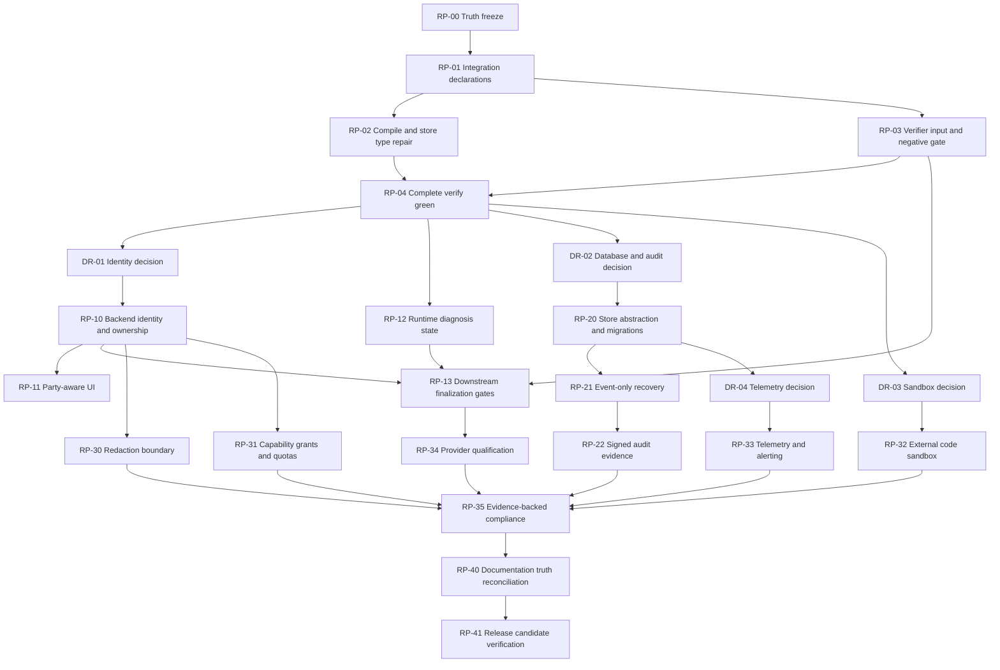

# Readiness remediation implementation plan — 2026-08-19

## Plan identity

- **Repository:** `subactor/intent-contract-dsl-runtime`
- **Planning ticket:** [`project/ticket-042`](../project/ticket-042/README.md)
- **Planning authority:** [`remediation-intent.dsl.json`](../project/ticket-042/remediation-intent.dsl.json)
- **Intent ID:** `RI-READINESS-AUDIT-CONSENSUS-20260819`
- **Intent digest:** `76b3350ce1064c5973d1d092c5443a33a675209c72bcd20738ff98654824cd53`
- **Reports bundle digest:** `047a1b960b6f151a0f67764a4c936d2b20a9e20d76b34bd5ea28632bd562dc34`
- **Planner:** `autogrammar/todo2code` 0.5.0, deterministic mode
- **todo2code graph fingerprint:** `9d6924e15d1e02375ee7bf7eaf73b62a8840416b4050fb70f4cf98fc9dda62ef`
- **todo2code diagnostics digest:** `814c710f9129f5f699bdaa055c4e2bc48b1811b3f534c56cad76281ccadef6c8`
- **todo2code plans digest:** `12f84b8d5c4a07b4a2f0877ec167c299595245b6f75522bae7d23330e339dda8`
- **Plan status:** proposed; implementation requires new bounded tickets and explicit authorization

## Inputs

This plan consolidates the overlapping and independently verified findings in:

1. [`gemini-3-7-flash-readiness-gap-audit-2026-08-19.md`](gemini-3-7-flash-readiness-gap-audit-2026-08-19.md)
2. [`claude-opus-5-medium-readiness-gap-audit-2026-08-19.md`](claude-opus-5-medium-readiness-gap-audit-2026-08-19.md)
3. [`gpt-5-6-sol-project-readiness-gap-audit-2026-08-19.md`](gpt-5-6-sol-project-readiness-gap-audit-2026-08-19.md)

All three reports agree on the central verdict: the offline MVP has substantial
verified value, but the repository is not buildable through its declared release
pipeline and its production-facing controls do not justify production claims.

## Tool selection

The following local tools were considered:

| Tool                | Repository              | Fit                                                                                                                        | Decision                                                                |
| ------------------- | ----------------------- | -------------------------------------------------------------------------------------------------------------------------- | ----------------------------------------------------------------------- |
| `todo2code` / `t2c` | `autogrammar/todo2code` | Builds Intent Evidence DSL from task, TODO, Git, AST and documentation; emits diagnostics and hash-bound code-change plans | **Selected**                                                            |
| Goal                | `semcod/goal`           | Release autopilot for tests, commits, versions and push                                                                    | Use only for terminal release/workspace checks, not planning            |
| Diagit              | `subactor/diagit`       | Fleet auditor and repair-plan generator from Diagit findings                                                               | Not selected: does not ingest these three reports as the primary intent |
| ITERUN              | `autogrammar/iterun`    | Generates executable service intents and deployment artifacts                                                              | Not selected: execution/deployment scope is too broad                   |
| nlp2cmd             | `autogrammar/nlp2cmd`   | Natural-language to executable command plan                                                                                | Not selected: command execution plan is not a code-remediation roadmap  |

`todo2code` is the only candidate whose documented boundary matches this task:
it can extract the three reports, current source and a bounded remediation task,
then compare declared intent with AST/Git reality.

## todo2code execution and fail-closed result

The accepted remediation intent was validated first:

```text
schema: new-project.remediation-validation/v1
intentDigest: 76b3350ce1064c5973d1d092c5443a33a675209c72bcd20738ff98654824cd53
findings: 6
actions: 6
errors: 0
warnings: 0
ok: true
```

The deterministic pipeline used:

- `project/ticket-042/REMEDIATION.task.md`;
- `project/ticket-042/REMEDIATION.todo.md`;
- only the three readiness reports as documentation;
- current Git and AST evidence;
- no changelog input;
- no communication analysis;
- no LLM, network or fallback.

The pipeline succeeded technically but emitted zero grounded code-change plans:

```text
codeChangePlanning.status: succeeded
codeChangePlanning.effectiveMode: deterministic
codeChangePlanning.recordCount: 0
planIds: []
```

The digest-bound advisory overlay reports:

- six `T2C_PLAN_GAP` findings, one for each accepted finding;
- six `T2C_CRITERION_GAP` findings, one for each acceptance criterion;
- no scope expansion and no unauthorized deletion.

This is not treated as approval to do nothing. The deterministic linker associated
intent with existing target paths and therefore could not distinguish “the file
exists” from “the required behavior exists”. Adding explicit missing symbols did
not change that result. The limitation is consistent with todo2code's own
readiness note that semantic coverage on foreign repositories remains incomplete.

Therefore:

1. the empty generated plan is rejected as insufficient;
2. no path is inferred beyond the accepted remediation intent;
3. the implementation sequence below is a human-reviewable projection of the
   six validated actions and acceptance criteria;
4. every future implementation ticket must run todo2code again after its scoped
   task identifies exact behavior and tests;
5. no item may be marked complete from symbol or endpoint presence alone.

## Required decisions before implementation

The plan intentionally does not choose infrastructure vendors. The following
human-owned decisions must be recorded before their dependent tickets enter
`EDIT`:

| Decision                           | Required before                    | Minimum decision evidence                                                               |
| ---------------------------------- | ---------------------------------- | --------------------------------------------------------------------------------------- |
| Identity provider and tenant model | Authentication implementation      | Issuer, audience, token lifecycle, role source, tenant boundary, local test mode        |
| Transactional database             | Durable persistence implementation | Engine, deployment mode, migration policy, backup/restore, concurrency model            |
| Audit trust anchor                 | Signed audit implementation        | Signing service or transparency log, key custody, rotation, verification and revocation |
| External sandbox                   | Generated-code isolation           | OS boundary, network policy, CPU/memory/process/disk/time limits, image lifecycle       |
| Telemetry backend                  | Observability implementation       | Metrics/logs/traces destination, retention, PII policy, alert delivery                  |
| Live provider qualification policy | Provider implementation            | Provider/model versions, evidence expiry, quality thresholds, failure modes and budget  |

Until a decision is accepted, implementation must use an interface and a
fail-closed `UNCONFIGURED`/`UNKNOWN` state rather than selecting a vendor by
assumption.

## Dependency graph



## Wave 0 — Stop false assurance and restore engineering integrity

No production feature work should start until this wave is complete.

### RP-00 — Truth freeze and negative regression inventory

**Workstream:** governance
**Finding coverage:** all six findings
**Purpose:** prevent more completion claims while controls remain unverified.

Actions:

1. Reopen or narrow TODO/ticket claims that describe authentication, persistence,
   redaction, capability grants, telemetry, qualification, compliance or
   sandboxing as production-complete.
2. Add an evidence status vocabulary: `MOCK`, `PACKAGE`, `WIRED_OFFLINE`,
   `DEPLOYMENT_EVIDENCE`, `PRODUCTION_VERIFIED`.
3. Require every control ticket to include at least one negative regression that
   fails when the control is disconnected.
4. Keep version `0.12.0` and all production claims blocked until RP-41.

Owned paths:

- `TODO.md`
- `README.md`
- `HANDOFF.md`
- `VERSION`

Acceptance:

- no active document claims production behavior from endpoint/function presence;
- each open control has an owner, evidence level and negative acceptance test;
- documentation tests pass.

Rollback: revert only the claim/status edits; never re-mark an item complete
without restored evidence.

### RP-01 — Declare backend integration boundaries

**Workstream:** integration
**Finding coverage:** `F-RELEASE-GATES`
**Purpose:** make package and architecture dependencies truthful before code repair.

Actions:

1. Decide whether backend directly owns renderer, testgen and codegen orchestration
   or whether a runtime orchestration package should own them.
2. If direct ownership is accepted, add workspace dependencies for:
   - `@office-dsl/codegen`;
   - `@office-dsl/document-renderer`;
   - `@office-dsl/testgen`.
3. Update `project.manifest.yml` with the same dependency direction.
4. Regenerate `pnpm-lock.yaml` through pnpm; do not edit lock data manually.
5. Add an architecture regression proving an undeclared backend package import
   fails.

Owned paths:

- `apps/backend/package.json`
- `project.manifest.yml`
- `pnpm-lock.yaml`
- `tests/architecture.test.ts` if a focused regression is required

Acceptance:

```text
corepack pnpm run architecture:validate => PASS
```

Rollback: revert manifest, package and lockfile together.

### RP-02 — Repair compiler and store type contract

**Workstream:** application
**Finding coverage:** `F-RELEASE-GATES`
**Depends on:** RP-01

Actions:

1. Import `TaskSession` in `tests/store.test.ts`.
2. Keep creator identity narrowed to the declared creator union through
   `recoverSessionFromAuditTrail`; do not cast a general string.
3. Replace the inconsistent verifier mode union with one versioned provider mode
   contract; ensure `python`, `mock` and live-provider meanings are distinct.
4. Fix the backend `prefer-const` lint failure.
5. Format only touched source/test files in this ticket.

Owned paths:

- `packages/dsl-runtime/src/index.ts`
- `packages/dsl-runtime/src/store.ts`
- `tests/store.test.ts`
- `apps/backend/src/server.ts`

Acceptance:

```text
corepack pnpm run typecheck => PASS
corepack pnpm run build => PASS
corepack pnpm run lint => PASS
```

Negative regression: the creator type test must reject an arbitrary creator
string rather than hiding it with a cast.

Rollback: revert type-contract changes as a unit; preserve task data.

### RP-03 — Repair semantic verification and make failure observable

**Workstream:** application
**Finding coverage:** `F-VERIFIER-FALSE-PASS`
**Depends on:** RP-01

Actions:

1. Add a single explicit projection function, provisionally named
   `buildSessionSemanticVerifierInput`, that maps:
   - original request/source text;
   - current approved Intent/Contract DSL;
   - current rendered document when present;
   - codegen verifier input when present;
   - testgen verifier input when present.
2. Reject verification when required evidence is unavailable instead of sending
   an empty input.
3. Persist the newly returned semantic report and process status into session
   audit before saving.
4. Transition `FAIL` and `NEEDS_REVIEW` to a blocking runtime state.
5. Return the same fresh report in the HTTP response; never mix creation-time and
   current verifier status.
6. Add negative backend tests for:
   - contradictory source and DSL;
   - required missing field;
   - rendered-document mismatch;
   - failed generated test;
   - invalid verifier process response.

Owned paths:

- `apps/backend/src/server.ts`
- `packages/verifier-bridge/src/index.ts`
- `verifier/office_dsl_verifier/core.py`
- `tests/backend.test.ts`
- `tests/semantic-verifier.test.ts`

Acceptance:

```text
corepack pnpm vitest run tests/backend.test.ts tests/semantic-verifier.test.ts
corepack pnpm run python:test
```

Required negative outcome: at least one fixture that currently returns `PASS`
must return `FAIL` or `NEEDS_REVIEW` and block execution.

Rollback: revert projection and endpoint wiring together; if reverted, disable
`POST /verify` rather than restoring false PASS behavior.

### RP-04 — Green complete verification baseline

**Workstream:** integration
**Finding coverage:** `F-RELEASE-GATES`
**Depends on:** RP-01, RP-02, RP-03

Actions:

1. Format all remaining reported files in bounded batches owned by their
   respective workstreams.
2. Run host and pinned Docker pipelines.
3. Save exact-head evidence for architecture, typecheck, build, lint, format,
   TypeScript tests, Python tests and all example families.
4. Do not add skip, ignore or policy exceptions to make the gate green.

Acceptance:

```text
project\governance-check.bat => PASS
corepack pnpm run verify => PASS
docker compose run --rm verify => PASS
git diff --check => PASS
```

Exit condition: the exact commit passes all checks. Feature remediation remains
blocked otherwise.

## Wave 1 — Establish identity and finalization invariants

### DR-01 — Identity and tenant decision record

**Workstream:** interfaces/integration
**Required before:** RP-10

Record:

- identity issuer and validation method;
- principal and tenant identifiers;
- Human1/Human2 role source;
- token expiry, revocation and key rotation;
- local deterministic test identity;
- endpoint authorization matrix.

Acceptance: a human-approved decision exists; no secret value is committed.

### RP-10 — Trusted backend identity, ownership and authorization

**Workstream:** application
**Finding coverage:** `F-AUTHORIZATION`
**Depends on:** DR-01, RP-04

Actions:

1. Replace `knownPrincipals` and arbitrary-token fallback with the accepted
   server-side identity verifier.
2. Ignore client-supplied principal/party identity headers unless they come from
   an explicitly trusted proxy boundary covered by DR-01.
3. Remove the `unauthenticated:<party>` approval fallback.
4. Bind every task to tenant and owner identity.
5. Enforce separate permissions for read, edit, answer, approve, verify, execute,
   render, generate and audit export.
6. Record actor, tenant, decision and denial reason in redaction-safe audit.
7. Add negative tests for missing, unknown, expired, forged, cross-party and
   cross-tenant credentials.

Owned paths:

- `apps/backend/src/server.ts`
- `tests/backend.test.ts`
- `tests/security.test.ts`

Acceptance:

- anonymous approval returns 401;
- Human1 cannot approve as Human2;
- an owner in tenant A cannot read or mutate tenant B;
- valid same-tenant role operations pass;
- audit identifies the trusted actor without storing credentials.

Rollback: disable protected endpoints rather than reverting to anonymous access.

### RP-11 — Party-aware authenticated UI

**Workstream:** application
**Finding coverage:** `F-AUTHORIZATION`
**Depends on:** RP-10

Actions:

1. Add a login/session boundary compatible with DR-01.
2. Show only operations authorized for the active principal.
3. Never show both Human1 and Human2 approval controls to one principal unless
   an explicit administrator review role is active—and that role must not grant
   approval power.
4. Handle 401, 403, stale hash and verifier failure explicitly.
5. Keep tokens out of DOM, logs and generated artifacts.

Owned paths:

- `apps/web/public/index.html`
- focused web/backend tests

Acceptance: browser-flow tests prove separate principals approve the same current
hash and one principal cannot impersonate the other.

### RP-12 — Persist diagnosis as runtime state

**Workstream:** application
**Finding coverage:** `F-FINALIZATION-GATE`
**Depends on:** RP-04

Actions:

1. Add a single diagnosis refresh function, provisionally
   `refreshIntentContractDiagnosis`.
2. Invoke it on DSL creation/update, question answer, assumption approval,
   conflict resolution and approval mutation.
3. Persist generated questions, party ownership, gaps, conflicts, assumptions,
   source issues and `finalizationReady` in session audit/state.
4. Invalidate downstream artifacts whenever the canonical hash or diagnosis
   changes.
5. Ensure replay/recovery can recompute or restore the same diagnosis.

Owned paths:

- `packages/dsl-runtime/src/index.ts`
- `tests/runtime.test.ts`

Acceptance: runtime tests prove every blocking status changes
`finalizationReady` to false and resolution changes it to true without guessing.

### RP-13 — Gate all downstream finalization operations

**Workstream:** application
**Finding coverage:** `F-FINALIZATION-GATE`, `F-VERIFIER-FALSE-PASS`
**Depends on:** RP-03, RP-10, RP-12

Actions:

1. Require current-hash bilateral approval and `finalizationReady=true` for final
   document rendering, testgen, codegen and verifier acceptance.
2. Keep draft rendering explicitly available as `DRAFT` with visible unresolved
   markers; never return it as finalized.
3. Require successful current semantic verification before real execution.
4. Persist artifact input hash and invalidate artifacts after material changes.
5. Add conflict, missing-field, assumption, stale-approval and stale-artifact
   regressions.

Owned paths:

- `apps/backend/src/server.ts`
- `packages/dsl-runtime/src/index.ts`
- `tests/backend.test.ts`
- `tests/runtime.test.ts`

Acceptance: every blocking fixture receives a deterministic 409/blocked response;
only the same current approved and verified hash reaches finalization.

## Wave 2 — Durable state and trustworthy audit

### DR-02 — Database, migration and audit-anchor decision

**Workstream:** integration
**Required before:** RP-20

Record:

- transactional database engine and supported deployment;
- schema ownership and migration tool;
- event ordering, optimistic concurrency and idempotency;
- backup/restore objectives and tested procedure;
- retention, erasure and legal-hold behavior;
- protected audit signing/anchoring boundary.

### RP-20 — Store interface, transactional adapter and migrations

**Workstream:** application/integration
**Finding coverage:** `F-PERSISTENCE-AUDIT`
**Depends on:** DR-02, RP-04

Actions:

1. Extract a typed `TaskStore` contract from `FileTaskStore`.
2. Keep `FileTaskStore` as an explicitly local/offline adapter.
3. Add the selected transactional adapter and versioned migrations.
4. Enforce tenant ownership, expected version and idempotency in each write.
5. Store session snapshot and event append atomically.
6. Add migration forward/backward, concurrent writer and process interruption
   tests.

Acceptance: no lost update under concurrent writes; failed transaction leaves
neither partial state nor partial audit event.

### RP-21 — Event-only recovery and retention

**Workstream:** application
**Finding coverage:** `F-PERSISTENCE-AUDIT`
**Depends on:** RP-20

Actions:

1. Define complete event payloads and reducer invariants.
2. Add `rebuildSessionFromEvents` without calling snapshot `load`.
3. Treat snapshots as replaceable acceleration only.
4. Test recovery after snapshot deletion and corruption.
5. Implement retention separately for transient state, audit, legal hold and
   subject erasure.
6. Verify hash/order before applying each event.

Acceptance: deleting every mutable snapshot still permits deterministic recovery
from a valid event stream.

### RP-22 — Externally verifiable audit evidence

**Workstream:** infrastructure/application
**Finding coverage:** `F-PERSISTENCE-AUDIT`
**Depends on:** RP-21, DR-02

Actions:

1. Anchor event-chain roots outside the mutable application database.
2. Sign incident exports with protected signing infrastructure.
3. Include repository/service identity, tenant, task, actor, current hashes,
   event root, algorithm, key ID and verification instructions.
4. Add key rotation, expiry and revocation handling.
5. Test isolated edit, full-chain rewrite, replay, truncation and wrong-key cases.

Acceptance: an offline verifier rejects all tampered bundles and validates a
bundle against protected external evidence.

## Wave 3 — Implement production controls as behavior, not names

### RP-30 — Redaction at every boundary

**Workstream:** application
**Finding coverage:** `F-PRODUCTION-CONTROLS`
**Depends on:** RP-10, RP-20

Actions:

1. Apply redaction before task persistence, event append, structured log,
   telemetry, error response, audit export and provider request audit.
2. Replace denylist-only redaction with typed sensitive fields plus pattern
   defense-in-depth.
3. Preserve correlation without preserving credential value.
4. Test nested objects, arrays, headers, query strings, DSL fields, Unicode and
   error paths.
5. Add a repository artifact scan for seeded canary secrets.

Acceptance: canary credentials never appear in persisted, logged, exported or
returned data.

### RP-31 — Capability grants and configurable quotas

**Workstream:** application
**Finding coverage:** `F-PRODUCTION-CONTROLS`
**Depends on:** RP-10

Actions:

1. Add a deny-by-default `CapabilityGrantRegistry` bound to principal, tenant,
   connector, capability and resource scope.
2. Check grants immediately before each action, not only at plan creation.
3. Add quotas for steps, provider calls, bytes, generated artifacts and connector
   side effects with explicit reset windows.
4. Record allow/deny decisions without secrets.
5. Add tests proving removal of a grant changes execution from success to denial.

Acceptance: no external or write action runs without a current matching grant;
the hard-coded 50-step check is not presented as the complete quota system.

### DR-03 / RP-32 — External generated-code sandbox

**Workstream:** infrastructure
**Finding coverage:** `F-PRODUCTION-CONTROLS`
**Depends on:** DR-03, RP-04

Actions:

1. Define a sandbox adapter; keep Node permission flags as defense-in-depth only.
2. Execute in an ephemeral OS-isolated boundary with:
   - no network by default;
   - read-only base image;
   - bounded input/output mounts;
   - CPU, memory, process, disk and wall-clock limits;
   - non-root identity;
   - disposable workspace.
3. Capture deterministic exit and resource evidence.
4. Test dynamic import, encoded forbidden APIs, fork bombs, memory/disk exhaustion,
   symlink escape and timeout.

Acceptance: generated code cannot read host secrets, reach network, persist after
execution or exceed resource limits.

### DR-04 / RP-33 — Durable telemetry, alerts and runbooks

**Workstream:** infrastructure/application
**Finding coverage:** `F-PRODUCTION-CONTROLS`
**Depends on:** DR-04, RP-20

Actions:

1. Instrument request, state transition, identity decision, provider call,
   verifier, renderer, generation, sandbox and storage paths.
2. Export structured metrics, logs and traces to the selected backend.
3. Replace per-session pseudo-rate alerts with defined windows and thresholds.
4. Add alert delivery, deduplication, acknowledgement and escalation.
5. Add runbooks for identity, database, verifier, provider, sandbox and audit
   anchor failures.
6. Test that a synthetic failure creates the expected metric, trace and alert.

Acceptance: telemetry survives process restart and an operator can trace a task
through every boundary without exposing PII or secrets.

### RP-34 — Live provider qualification

**Workstream:** interfaces/application
**Finding coverage:** `F-PRODUCTION-CONTROLS`
**Depends on:** RP-03, RP-13

Actions:

1. Make default provider status `UNQUALIFIED`.
2. Define separate evidence contracts for LLM, OCR, PDF and verifier providers.
3. Validate credentials without exposing them, connectivity, schema compliance,
   timeout, malformed response, rate limit and fallback behavior.
4. Record provider/model/version, test set, thresholds, timestamp and evidence
   expiry.
5. Keep live qualification opt-in and separate from deterministic offline CI.
6. Add semantic/adversarial evaluation for hallucination, omission, source
   mismatch and conflict handling.

Acceptance: changing an environment string cannot make a provider qualified;
expired or failed evidence returns `UNQUALIFIED`.

### RP-35 — Evidence-backed compliance evaluation

**Workstream:** governance/application
**Finding coverage:** `F-PRODUCTION-CONTROLS`
**Depends on:** RP-22, RP-30, RP-31, RP-32, RP-33, RP-34

Actions:

1. Replace literal PASS records with `PASS|FAIL|UNKNOWN|EXPIRED` evidence-bound
   evaluations.
2. Bind each item to control version, environment, exact revision, evidence URI
   or digest, evaluator and expiry.
3. Default missing evidence to `UNKNOWN` or `FAIL` according to policy.
4. Remove claims such as zero vulnerabilities unless a current dependency scan
   is attached.
5. Separate machine control status from independent legal/privacy approval.
6. Add negative tests proving disconnected controls cannot return PASS.

Acceptance: current unconfigured development mode reports no false production
PASS values.

## Wave 4 — Truth reconciliation and release candidate

### RP-40 — Reconcile documentation and ticket lifecycle

**Workstream:** governance/integration
**Depends on:** all implemented controls

Actions:

1. Re-audit every item previously completed by tickets 048–057.
2. Mark only the exact proven scope complete.
3. Update README, TODO, ROADMAP, HANDOFF, VERSION and CHANGELOG consistently.
4. Preserve the three readiness audits as historical evidence and link closure
   evidence rather than rewriting their findings.
5. Keep implementation tickets `IN_PROGRESS / PUBLICATION` until exact-head
   review and trusted merge.

Acceptance: active documents agree on current behavior, deployment evidence and
remaining limitations.

### RP-41 — Release-candidate verification

**Workstream:** integration/infrastructure
**Depends on:** RP-40

Required evidence on one exact commit:

1. governance check PASS;
2. architecture, build, typecheck, lint and format PASS;
3. TypeScript, Python, Office, chat and recruitment suites PASS;
4. pinned Docker verification PASS;
5. authentication and tenant isolation negative suites PASS;
6. event recovery, backup and restore exercises PASS;
7. audit tamper/signature tests PASS;
8. sandbox adversarial tests PASS;
9. live provider qualification current or explicitly excluded from release;
10. observability synthetic incident and alert exercise PASS;
11. dependency, security, privacy and legal reviews current;
12. trusted review/attestation bound to repository, PR, HEAD, ticket and actor.

Release rule: any missing production evidence keeps the project classified as an
offline MVP. No static compliance response may override a failed or absent check.

## Cross-cutting test policy

Every implementation ticket must contain:

- a failing regression before the fix where practical;
- a negative test showing the control changes an outcome;
- a positive test for the permitted path;
- stale-hash/replay/concurrency tests where state is involved;
- no network requirement for deterministic offline CI;
- exact affected paths inside ticket intent;
- governance check and relevant stack checks;
- self-review against the three source audits.

Shape-only assertions are insufficient. Examples of prohibited acceptance:

- “response has a `verdict` property” without a fixture that changes the verdict;
- “function `redactSecrets` exists” without verifying persisted files;
- “provider is qualified” based only on an environment variable;
- “telemetry class exists” without an emitted external metric;
- “audit has a digest” without external signature verification;
- “both roles approved” when one anonymous session can impersonate both.

## Ticket allocation strategy

This plan is intentionally not one implementation ticket. Before editing source:

1. allocate each RP item with `project/new-ticket.sh` after fetch/prune;
2. create a separate branch/worktree;
3. reserve only one active ticket per workstream;
4. keep integration paths (`package.json`, `pnpm-lock.yaml`, shared docs) under an
   integration ticket;
5. avoid overlapping `apps/backend/src/server.ts` ownership by completing and
   merging one backend ticket before activating the next;
6. keep ticket-042 documentation-only and in `PUBLICATION` until this plan is
   reviewed and merged;
7. do not use todo2code advisory output as merge approval.

## Completion definition

The remediation program is complete only when:

- all six accepted findings have deterministic closure evidence;
- todo2code re-analysis no longer emits a plan gap for the accepted implementation
  tasks, or the remaining tool limitation is separately documented without
  weakening project acceptance;
- no production control reports PASS without evidence;
- all release gates pass on the same exact revision;
- trusted merge and release evidence exists;
- a fresh independent readiness audit classifies production use as ready for the
  declared deployment scope.

Until then, the correct classification remains:

> **Advanced offline MVP and reference implementation; not approved for
> production use.**